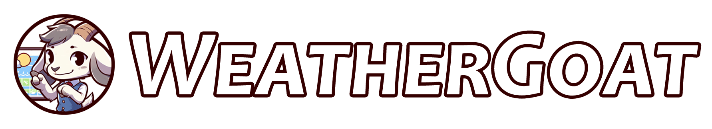

<div align="center">
	
</div>

A Discord bot for reporting weather alerts and hourly forecasts to channels. Built with [Bun](https://bun.sh), [Discord.js](https://discord.js.org), [Prisma](https://www.prisma.io/orm), [Redis](https://redis.io), and the [National Weather Service API](https://www.weather.gov/documentation/services-web-api).

## Self-hosting/development

1. Create a `.env` file in the _project root_ directory and fill it out:
```env
MODE=development

BOT_ID=1234
BOT_TOKEN=token_here

DATABASE_URL=file:./.data/weathergoat.db
REDIS_URL=redis://localhost:6379

# optional
SENTRY_DSN=https://1234.ingest.us.sentry.io/5678

GITHUB_ACCESS_TOKEN=abcdef

MAX_RADAR_MESSAGES_PER_GUILD=5
MAX_ALERT_DESTINATIONS_PER_GUILD=5
MAX_FORECAST_DESTINATIONS_PER_GUILD=5
```
2. Run migrations with `bun migrate:p`
   - This won't do anything if there are no pending migrations
3. Run `bun generate-messages` at least once and after any edit to _assets/messages.json_ to generate message helpers
4. Register application commands globally with `bun start mc create` or in specific guilds with `bun start mc create <guild_id_1> <guild_id_2> <etc...>`
5. Run the bot with `bun start`
