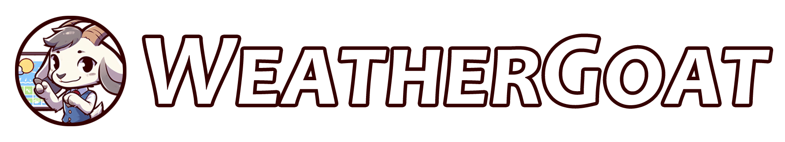

<div align="center">
	
</div>

A Discord bot for reporting weather alerts and hourly forecasts to channels. Built with [Bun](https://bun.sh), [Discord.js](https://discord.js.org), [Prisma](https://www.prisma.io/orm), [Redis](https://redis.io), and the [National Weather Service API](https://www.weather.gov/documentation/services-web-api).

**[Click here](https://discord.com/oauth2/authorize?client_id=1009028718083199016) to add WeatherGoat to your server.**

# Self-hosting

While self-hosting WeatherGoat really isn't supported, it's not hard to get it set up and running.

First create a `.env` file in the project root and configure it:

```
MODE=development

BOT_ID=1234
BOT_TOKEN=abcd
BOT_OWNER_ID=5678

OWNER_PREFIX=$

DATABASE_URL=file:./.data/weathergoat.db
REDIS_URL=redis://localhost:6379
REDIS_PREFIX=wg

MAX_RADAR_MESSAGES_PER_GUILD=1
MAX_ALERT_DESTINATIONS_PER_GUILD=2
MAX_FORECAST_DESTINATIONS_PER_GUILD=2
```

Make sure you have a running Redis instance to use.

Next run `bun migrate:p` to run migrations in production mode, `bun generate-messages` to generate the message catalog and `bun generate-client` to generate the Prisma client code for your environment.

Finally use `bun start` to start the bot. Make sure you set the `MODE` environment variable to `production` unless you want verbose websocket logging flooding your logs.

For managing application commands, see owner-only commands below.

# Development

As of version `2026.4.3`, owner-only commands now use the legacy prefixed commands system and the bot requires the `MESSAGE_CONTENT` intent. These commands should be called in a server you share with the bot where _you_ have the `ADMINISTRATOR` permission.

Use the `commands create` command to apply application commands globally or `commands create [guildIds:string...]` to apply commands to specific guilds. You can also use `delete` in place of `create` to instead delete application commands globally or in specific guilds.
